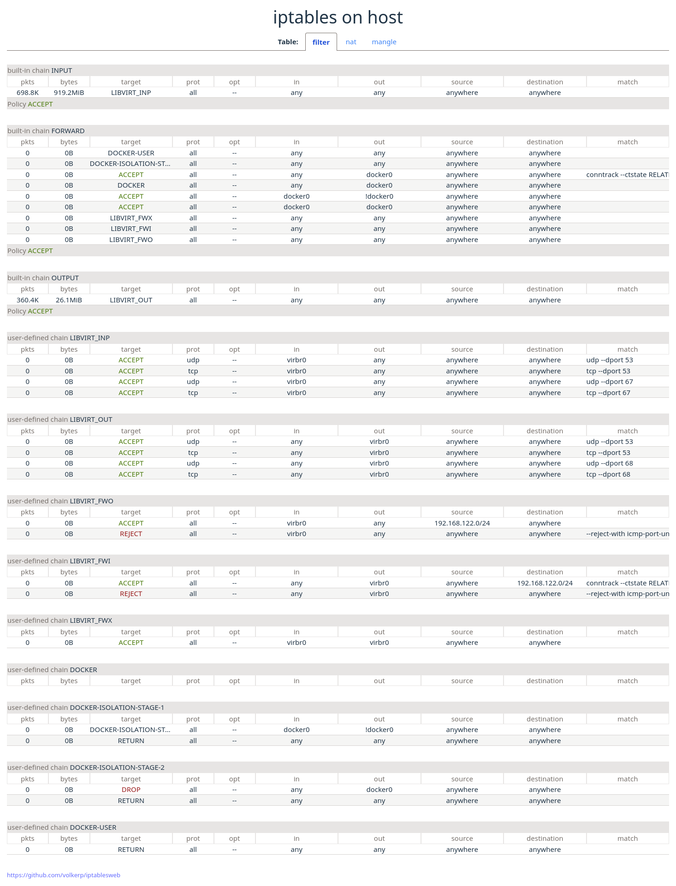

# iptablesweb

A small rust project that visualizes the contents of iptables in a web interface. 

An example to embedd a [SPA](https://en.wikipedia.org/wiki/Single-page_application) into a  rust binary with minimal runtime dependencies.
It uses [svelte](https://svelte.dev), [vite](https://vitejs.dev), [tailwindcss](https://tailwindcss.com) on the web frontend. And rust, [warp](https://github.com/seanmonstar/warp) on the backend. 

Credits to the Rust+Vite+Svelte project https://github.com/fdeantoni/rust-vite-svelte and the iptables_exporter project https://github.com/kbknapp/iptables_exporter where this project took inspiration and code from.



To run it, download the latest release from the [releases](https://github.com/volkerp/iptablesweb/releases), make it executable and run it as root or sudo.

```bash
chmod +x iptablesweb
sudo ./iptablesweb
```

The web frontend is accessed on http://localhost:3030

## Development

To build the project from source, first build the web frontend:

```bash
cd web
npm install
npm run build
```

This creates a single page web application in the _web/dist_ folder.

Then build the rust project:
```bash
cd ..
cargo build --release
```

This compiles the rust application and links the web frontend into the application binary.
The binary is _target/release/iptablesweb_ 

Run it
```bash
sudo target/release/iptablesweb
```

It must be run as root or sudo to run the _iptables-save_ command and process its output.


